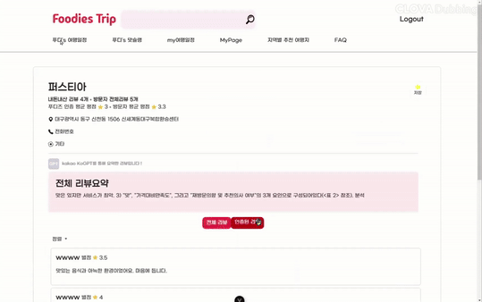

# FoodiesTrip

## 🥞 개요

    

- 팀명: **배고픈미슐랭**
- 서비스명: **FoodiesTrip: 식도락 여행 웹 플랫폼**

 

## 🍔 기획배경

- 여행을 즐기는 2030 세대를 위한 맛집 탐방의 중요성
- 맛집 협찬 및 광고성 게시물과 왜곡된 맛집 정보로 인한 혼란 해소
- 신뢰할 수 있는 맛집 정보 제공과 맞춤형 여행 계획 지원

 

## 🥪 서비스 소개

- **'Foodie Trip'** 은 사용자가 신뢰할 수 있는 맛집 리뷰와 함께 맞춤형 여행 계획을 세울 수 있는 서비스입니다.
- 생성형 AI 기반의 인증 맛집 리뷰 요약을 제공하여 맛집찾기에 도움을 줍니다.
- 전국 맛집과 관광지를 한눈에 검색하고, 다른 사용자의 여행 플랜을 쉽게 복사하거나 커스텀하여 활용할 수 있습니다.
- 여행 계획에 꼼꼼한 사람들을 위한 여행 체크리스트, 여행 계획을 세우는 것이 부담스러운 사람을 위한 여행 추천 기능을 통해 맞춤형 계획이 가능합니다.
- 내돈내산 리뷰를 통해 광고성/협찬 리뷰를 필터링할 수 있습니다.

 

## 🌭 차별성

- 2024 여행 트렌드 중 하나인 **맛**에 중점을 둬 여행 관광지 정보뿐만 아니라 지
  역의 맛집 정보를 제공한다
- 여행 플랜을 작성한 후 사용자들과 공유를 통해 추천 찜할 수 있으며 인기있는 여
  행 플랜 5개를 추천받아 커스텀을 제공하여 여행 계획 설정에 부담을 줄였다.
- '푸디즈의 맛슐랭 게시판'을 통해 알려지지 않은 로컬 맛집 리뷰를 생성형 AI를 통
  해 내돈내산 리뷰 요약을 바탕으로 신뢰성있는 정보를 제공한다.

## 🥨 주요 기능

|                                          |                                          |
| ---------------------------------------- | ---------------------------------------- | --- |
| 🍦 메인페이지                            | 🍩 로그인                                |
|       |          |
| 🍪 회원가입                              | 🥫 마이페이지                            |
|        |      |
| 🍹 맛집추천                              | 🍅 여행지룰렛                            |
|        |      |
| 🥓 여행계획                              | 🥭 여행체크리스트                        |
|        |  |
| 📖 여행계획추천                          | 🍧 타사용자 여행 계획 커스텀             |
|    |    |
| 🍱 여행계획게시판                        | 🍣 관광지검색                            |
|  |      |
| 🍵 맛슐랭                                | 🍰 리뷰작성                              |
|          |        |
| <!--                                     | 🍬 리뷰요약                              |     |
|        |                                          | --> |

 

## 🍜 ERD 다이어그램

 

## 💬 요구사항정의서

## 🍛 사용 기술

**FE**

  

  

  

  

**BE**

**DevOps**

**협업**

 

<!-- ## 🥘 시스템 아키텍처

 -->

## 🍔개발환경

| 분야     | 기술 스택      | 버전   |
| -------- | -------------- | ------ |
| Backend  | Java           | 17     |
|          | Spring Boot    | 3.3.2  |
|          | MyBatis        | 3.0.3  |
| Database | MySQL          | 8.0    |
| Frontend | Vue.js         | 3.4.21 |
|          | JavaScript     | 3.5.1  |
|          | pinia          | 2.1.7  |
| DevOps   | Docker         | 27.1.2 |
|          | Docker Compose | 2.1.0  |

## 🍙빌드 및 배포 환경

| 도구  | 버전  |
| ----- | ----- |
| Maven | 4.0.0 |

## 🍖실행 방법

| 도구        | 방법             |
| ----------- | ---------------- |
| Spring boot | AWS, EC2, Docker |
| MySql       | AWS, EC2, Docker |
| Jenkins     | AWS, EC2, Docker |
| Vue         | AWS, EC2, Docker |

##  팀원소개

|  |  |
| :------------------------------------------------------------: | :------------------------------------------------------------: |
|                             서지흔                             |                             유병주                             |
|                    팀장, Backend, Frontend                     |                    Backend, Frontend, Infra                    |
